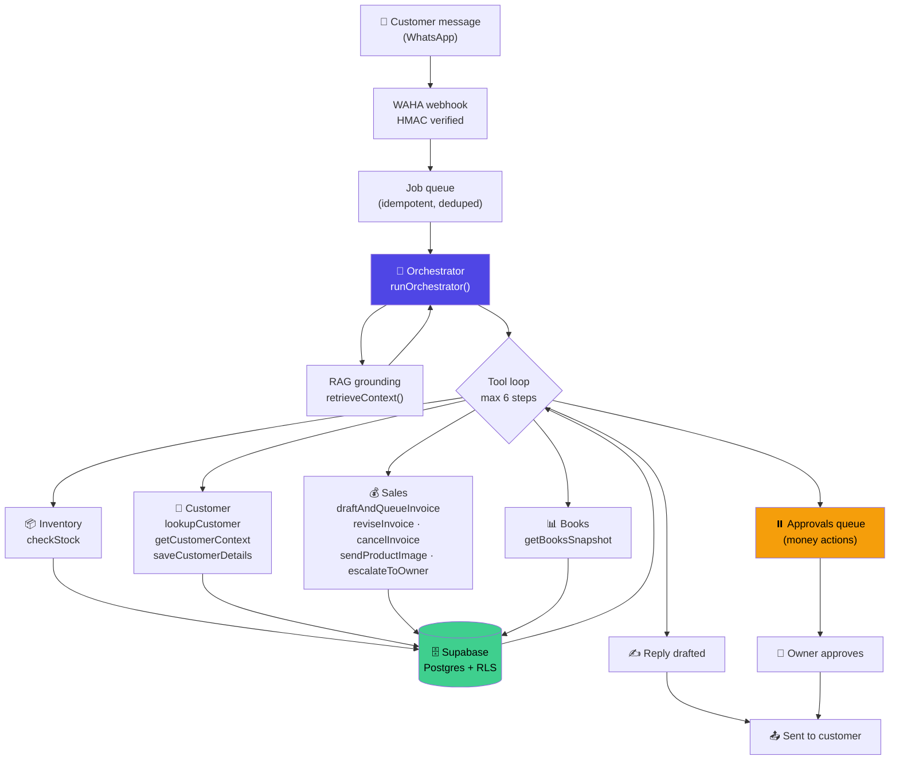
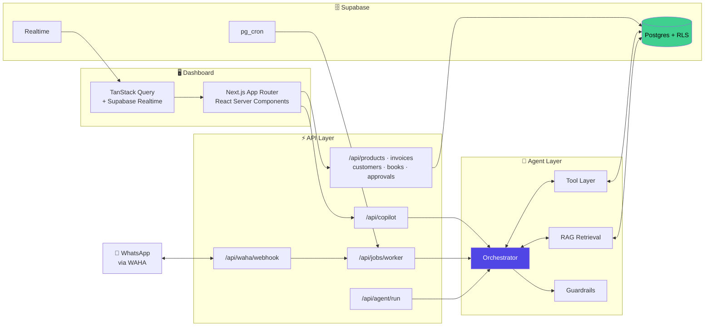

<div align="center">

# 🗂️ Deskops AI

### The AI back office for small businesses that run on WhatsApp

Deskops AI reads incoming customer messages, grounds itself in the shop's **real** catalog, stock and ledger, and takes action — quoting, invoicing, adjusting inventory and writing the books — while every money decision still stops for the owner's approval.

<p>


</p>

<p><em>IDEALIZE 2026 — Open Category Prototype</em></p>

</div>

---

## Table of Contents

- [The Problem](#the-problem)
- [What It Does](#what-it-does)
- [🤖 The AI Agent](#-the-ai-agent) ← *the part that matters*
- [Guardrails & Responsible AI](#guardrails--responsible-ai)
- [Tech Stack](#tech-stack)
- [System Architecture](#system-architecture)
- [Data Model](#data-model)
- [Getting Started](#getting-started)
- [Project Structure](#project-structure)
- [Feature Tour](#feature-tour)
- [Roadmap](#roadmap)
- [Deviations from the Proposal](#deviations-from-the-proposal)
- [Licensing & Third-Party Credits](#licensing--third-party-credits)
- [Team](#team)

---

## The Problem

A small shop owner's day is not spent running the shop. It's spent on WhatsApp.

> *"What's the price of this?"* · *"Do you have 20 in stock?"* · *"Can you send me a bill?"*

Every one of those messages requires the owner to stop, check a physical shelf or a spreadsheet, do arithmetic in their head, type a reply, and — later, if they remember — write the sale into a book. Multiply by fifty messages a day.

Generic AI chatbots make this **worse**, not better. A chatbot that confidently quotes a price it invented, or promises stock the shop doesn't have, costs the owner a customer and their reputation.

**Deskops AI is built on the opposite premise:** the AI is never allowed to know a number. It has to go and look it up.

---

## What It Does

| | |
|---|---|
| 📥 **Reads** | Ingests WhatsApp messages via WAHA webhook, per-business, signature-verified |
| 🔍 **Grounds** | Retrieves the shop's real catalog, stock levels, customer history and ledger before responding |
| 🧠 **Reasons** | Plans a multi-step tool sequence — check stock → look up customer → price the order → draft the invoice |
| ✋ **Stops** | Anything that becomes money queues in **Approvals**; the owner approves before it's real |
| 📚 **Records** | Stock movements, invoices, ledger entries and audit logs all written automatically |

---

## 🤖 The AI Agent

> **This is not a chatbot, and not a single-prompt wrapper.** It is a tool-calling agent that plans across multiple steps, queries live business data, and writes to the database — with a human approval gate on financial actions.

### Design: one orchestrator, scoped specialist toolsets

Deskops AI runs a **single reasoning loop** (the Orchestrator) that is handed different *scoped tool groups* depending on context. Specialists — Inventory, Sales, Customer, Books — are **capability boundaries**, not separate agent processes. This was a deliberate choice: it gives one coherent plan per customer message instead of several agents negotiating with each other, and it keeps token cost and latency inside what a small shop can afford.



### The tools it can actually call

Every tool is a real, typed, Zod-validated function that hits Postgres. None of them are stubs.

| Tool | Group | What it does |
|---|---|---|
| `checkStock` | Inventory | Real stock levels and prices from the catalog |
| `lookupCustomer` | Customer | Find a customer by WhatsApp number + order history |
| `getCustomerContext` | Customer | Pull conversation and relationship context |
| `saveCustomerDetails` | Customer | Persist name, address, phone as they're learned |
| `draftAndQueueInvoice` | Sales | Build an invoice from catalog prices → **queue for approval** |
| `reviseInvoice` | Sales | Replace the full item list when the customer changes their order |
| `cancelInvoice` | Sales | Void an unpaid invoice on cancellation |
| `sendProductImage` | Sales | Send catalog imagery into the chat |
| `escalateToOwner` | Sales | Hand off to a human when the agent shouldn't decide |
| `getBooksSnapshot` | Books | Income/expense totals computed from the real ledger |

Sales tools are only mounted when the run is bound to a real conversation — the agent physically cannot draft an invoice outside a customer chat.

### Worked example — input → steps → output

<table>
<tr><td width="90"><strong>📥 INPUT</strong></td><td>

> *"Hi, do you have 20 ceramic mugs? What is the price?"*

</td></tr>
<tr><td><strong>⚙️ STEPS</strong></td><td>

1. **Webhook → queue.** Message deduped against `webhook_events`, enqueued as a job.
2. **Ground.** `retrieveContext()` pulls the top 6 relevant business documents into the system prompt.
3. **Plan.** Orchestrator determines this needs stock verification *and* a quote.
4. **Tool call →** `checkStock({ query: "ceramic mug" })` → *real* stock count and unit price from `products`.
5. **Tool call →** `lookupCustomer({ phone })` → returning customer? prior orders?
6. **Tool call →** `draftAndQueueInvoice({ items })` → **totals computed in TypeScript, not by the model** → row written to `approvals` with status `pending`.
7. **Log.** Token usage written to `model_usage`; the action lands in `audit_logs`.

</td></tr>
<tr><td><strong>📤 OUTPUT</strong></td><td>

A grounded reply to the customer with true stock and true pricing — **plus** an invoice sitting in the owner's Approvals queue. On approval: `stock_movements` adjusts inventory, `ledger_entries` books the sale, and the dashboard updates in realtime.

</td></tr>
</table>

### Why this qualifies as an agent

| Requirement | How Deskops AI satisfies it |
|---|---|
| **Tool use** | 10 typed tools with Zod schemas, all hitting live Postgres |
| **Multi-step workflow** | `stopWhen: stepCountIs(6)` — the loop chains tool calls and re-reasons on each result |
| **Decision-making** | Chooses *which* specialists to engage from the message alone; decides when to escalate vs. act |
| **Memory** | Conversation history, persisted customer profiles, and RAG retrieval over business documents |
| **Planning** | Sequences dependent calls — stock must resolve before an invoice can be priced |
| **Real consequences** | Writes invoices, moves stock, books ledger entries — not a simulated demo path |

---

## Guardrails & Responsible AI

Implemented in [`src/lib/ai/guardrails.ts`](src/lib/ai/guardrails.ts) and enforced at the tool layer:

| Guardrail | Implementation |
|---|---|
| 🔢 **The model never does arithmetic** | Every total is computed in TypeScript from catalog prices. `verifyAmountAgainstSource()` rejects any figure the model echoes that doesn't match the database. |
| ✋ **Human-in-the-loop on money** | `draftAndQueueInvoice` writes to `approvals` with `pending` status. Nothing financial executes without owner action. |
| 🔒 **PII redaction** | `redactPii()` strips phone numbers and emails before any text reaches a log line or model trace. |
| 🏢 **Tenant isolation** | Row Level Security on every table — enforced by Postgres, not application code. |
| 🚦 **Abuse protection** | Upstash rate limiting on agent endpoints. |
| ✅ **Webhook authenticity** | HMAC signature verification on every WAHA inbound event. |
| 📊 **Cost transparency** | Per-business token accounting in `model_usage`. |

---

## Tech Stack

| Layer | Technology | Why |
|---|---|---|
| **Framework** | Next.js 16.2 (App Router) · React 19.2 | Server Components + Route Handlers in one deployable |
| **Language** | TypeScript 5 | Tool schemas are typed end to end |
| **Agent runtime** | Vercel AI SDK 7 (`ai`) | Provider-agnostic tool calling and streaming |
| **Models** | Google Gemini *(default)* · OpenAI · Anthropic Claude · Groq | Swappable per business in Settings — no code change |
| **Database** | Supabase (Postgres + RLS + Realtime) | Multi-tenant isolation enforced at the database |
| **Vector search** | pgvector via `embeddings` / `documents` | RAG grounding over business data |
| **WhatsApp** | WAHA | Self-hostable WhatsApp HTTP API |
| **Jobs** | Supabase `pg_cron` → worker route | Async agent runs + daily insight generation |
| **Rate limiting** | Upstash Redis | Serverless-native |
| **Data fetching** | TanStack Query 5 | Cache + realtime invalidation |
| **UI** | Tailwind v4 · shadcn/ui · Radix · Base UI · HugeIcons | Accessible primitives |
| **Charts / Motion** | Recharts · GSAP · Lenis | Dashboard analytics and landing page |
| **Validation** | Zod 4 | Tool input schemas and API boundaries |
| **Hosting** | Vercel | Native Next.js + cron support |

---

## System Architecture



**Message lifecycle:** WhatsApp → WAHA → signature-verified webhook → deduped job → orchestrator → RAG grounding → tool loop → reply + approval queue → owner action → stock/ledger writes → realtime dashboard update.

---

## Data Model

21 tables, **Row Level Security enabled on every one**, scoped by `business_id`.

<details>
<summary><strong>Expand full table list</strong></summary>

| Domain | Tables |
|---|---|
| **Tenancy** | `businesses` · `business_members` |
| **Messaging** | `conversations` · `messages` · `webhook_events` |
| **Catalog** | `products` · `product_categories` · `suppliers` |
| **Inventory** | `stock_movements` · `reorders` |
| **Sales** | `invoices` · `invoice_items` · `payments` · `customers` |
| **Accounting** | `ledger_entries` |
| **Agent** | `approvals` · `jobs` · `model_usage` · `daily_insights` |
| **RAG** | `documents` · `embeddings` |
| **Audit** | `audit_logs` |

</details>

Migrations live in [`supabase/migrations/`](supabase/migrations/) and run in order.

---

## Getting Started

### Prerequisites

- **Node.js** 20+
- **Supabase** project ([supabase.com](https://supabase.com)) or local CLI
- **WAHA** instance for WhatsApp ([waha.devlike.pro](https://waha.devlike.pro)) — *optional for dashboard-only development*
- At least one **AI provider API key** (Gemini is the default and has a free tier)

### 1. Clone and install

```bash
git clone https://github.com/<your-org>/deskops-ai.git
cd deskops-ai
npm install
```

### 2. Configure environment

```bash
cp .env.example .env.local
```

| Variable | Required | Purpose |
|---|:---:|---|
| `NEXT_PUBLIC_SUPABASE_URL` | ✅ | Supabase project URL |
| `NEXT_PUBLIC_SUPABASE_PUBLISHABLE_KEY` | ✅ | Client-side anon key |
| `SUPABASE_SERVICE_ROLE_KEY` | ✅ | Server-side admin operations |
| `GEMINI_API_KEY` | ⚪️ | Default provider |
| `OPENAI_API_KEY` | ⚪️ | Alternative provider |
| `ANTHROPIC_API_KEY` | ⚪️ | Alternative provider |
| `GROQ_API_KEY` | ⚪️ | Alternative provider |
| `AI_PROVIDER` | ⚪️ | Fallback provider — `google` \| `openai` \| `anthropic` \| `groq` |
| `WAHA_BASE_URL` | ⚪️ | WAHA instance URL |
| `WAHA_API_KEY` | ⚪️ | WAHA authentication |
| `WAHA_WEBHOOK_SECRET` | ⚪️ | HMAC secret for inbound webhook verification |
| `CRON_SECRET` | ⚪️ | Bearer token guarding the job worker route |
| `UPSTASH_REDIS_REST_URL` | ⚪️ | Rate limiting |
| `UPSTASH_REDIS_REST_TOKEN` | ⚪️ | Rate limiting |

> ⚠️ **At least one provider key is required** for the agent to run. API keys stay in the environment — users select a provider in Settings, they never paste keys into the app.

### 3. Apply migrations

```bash
supabase link --project-ref <your-project-ref>
supabase db push
```

### 4. Run

```bash
npm run dev
```

→ [http://localhost:3000](http://localhost:3000)

### 5. Onboard

Sign up, complete onboarding to create your business, then add products under **Products**. The agent has nothing to ground itself in until the catalog exists.

### 6. Connect WhatsApp *(optional)*

1. Start a WAHA session and note the session name
2. Set the session on your business record
3. Point the WAHA webhook at `https://<your-domain>/api/waha/webhook`
4. Set `WAHA_WEBHOOK_SECRET` on both sides

> Without WAHA, you can still exercise the full agent through the in-dashboard **Copilot** (`/api/copilot`).

---

## Project Structure

```
src/
├── app/
│   ├── (auth)/                  login · signup
│   ├── auth/callback/           OAuth return
│   ├── onboarding/              business setup
│   ├── dashboard/
│   │   ├── inbox/               + [conversationId]
│   │   ├── products/            + [productId] · new
│   │   ├── inventory/           + reorders
│   │   ├── invoices/            + [invoiceId] · new
│   │   ├── customers/           + [customerId]
│   │   ├── books/               + reports
│   │   ├── approvals/           ⏸️ human-in-the-loop gate
│   │   └── settings/            integrations · models · team
│   └── api/                     26 route handlers
│       ├── agent/run            agent entry point
│       ├── copilot/             in-dashboard agent chat
│       ├── waha/webhook         inbound WhatsApp (HMAC verified)
│       ├── jobs/worker          cron-driven async runs
│       ├── rag/search           vector retrieval
│       ├── approvals/           approve / reject queue
│       └── …                    products · invoices · customers · books · inventory · reorders · insights · onboarding · business · settings
│
├── lib/
│   ├── agents/                  orchestrator.ts · prompts/orchestrator.ts
│   ├── tools/                   inventory · sales · customer · books · context · index
│   ├── ai/                      provider.ts · guardrails.ts · embeddings.ts
│   ├── rag/                     ingest.ts · retrieve.ts
│   ├── db/                      14 server-side data-access modules
│   ├── query/                   TanStack Query hooks · keys.ts · realtime.ts
│   ├── jobs/                    enqueue.ts · worker.ts
│   ├── waha/                    client.ts · verify.ts
│   ├── supabase/                admin · client · server · proxy
│   ├── invoice/                 image.tsx (render) · send.ts
│   └── utils/                   contact.ts · money.ts
│
├── components/                  auth · copilot · customers · dashboard · inbox
│                                inventory · invoices · landing · products · ui
├── hooks/
├── types/
└── proxy.ts

supabase/migrations/             schema · RLS · pg_cron · realtime publication
docs/instructions/               engineering reference
```

---

## Feature Tour

| Page | Purpose |
|---|---|
| **Home** | Today's business summary + anything awaiting the owner |
| **Inbox** | Every WhatsApp conversation in one place, with agent activity inline |
| **Products** | Catalog with pricing, stock and imagery |
| **Inventory** | Live stock levels, low-stock flags, **Reorders** queue |
| **Invoices** | Quotes and invoices — create, revise, cancel |
| **Customers** | Profiles, contact details, full order history |
| **Books** | Automatic ledger from every sale, with **Reports** |
| **Approvals** | ⏸️ The safety gate — money actions wait here |
| **Settings** | WhatsApp **Integrations**, AI **Models**, **Team** management |

---

## Roadmap

**Next phase**

- [ ] **Payment reconciliation** — the `payments` table is modeled but not yet wired to a payment provider; close the loop from invoice → payment → ledger automatically
- [ ] **Supplier reorder automation** — `suppliers` and `reorders` exist; let the agent draft purchase orders when stock crosses threshold, subject to the same approval gate
- [ ] **Proactive agent runs** — move beyond reactive replies: daily insights already run on cron, extend to "three customers asked about an out-of-stock item this week"
- [ ] **Multi-channel** — the WAHA adapter is isolated behind an interface; add Instagram DM and Telegram
- [ ] **Voice notes** — transcribe inbound WhatsApp audio, a very common input for this user base
- [ ] **Sinhala / Tamil support** — evaluate model performance on local-language customer messages

**Hardening**

- [ ] Automated test suite over the tool layer and approval state machine
- [ ] Agent evaluation harness — scored regression set of customer messages
- [ ] Per-business cost caps using `model_usage` data

---

## Deviations from the Proposal

> 📌 **To be completed before submission.** The guidelines require any pivot in tech stack, features or agent behaviour to be explicitly justified. Fill this in against your original proposal.

| Area | Proposed | Built | Justification |
|---|---|---|---|
| *e.g. Agent topology* | *Multiple autonomous agents* | *One orchestrator with scoped specialist toolsets* | *Single coherent plan per message; lower latency and token cost — critical for the target user's budget* |
| | | | |
| | | | |

*If there were no deviations, state that explicitly — judges are evaluating how closely execution aligns with the original idea.*

---

## Licensing & Third-Party Credits

| Dependency | License | Use |
|---|---|---|
| [Vercel AI SDK](https://github.com/vercel/ai) | Apache-2.0 | Agent tool-calling runtime |
| [Supabase JS](https://github.com/supabase/supabase-js) | MIT | Database client |
| [WAHA](https://github.com/devlikeapro/waha) | Apache-2.0 (core) | WhatsApp HTTP API |
| [TanStack Query](https://github.com/TanStack/query) | MIT | Data fetching |


**AI model APIs** — Google Gemini, OpenAI, Anthropic and Groq are used via their official commercial APIs under their respective terms of service. No model weights are redistributed. API keys are supplied by the deployer and never bundled.

> 📌 **Add a `LICENSE` file to the repository root** and state the project's own license here.

---

## Team

**Team ONYX** — IDEALIZE 2026, Open Category

| Name | Institution | Role |
|---|---|---|
| **Imesh Madushan** | NIBM | Team Leader |
| Thiloko Indhuwari | NIBM | Member |
| Mayantha Udayanga | NIBM | Member |
| Nithija Kalpa | NIBM | Member |

---

<div align="center">
<sub>Built for the shop owners whose phone never stops.</sub>
</div>
