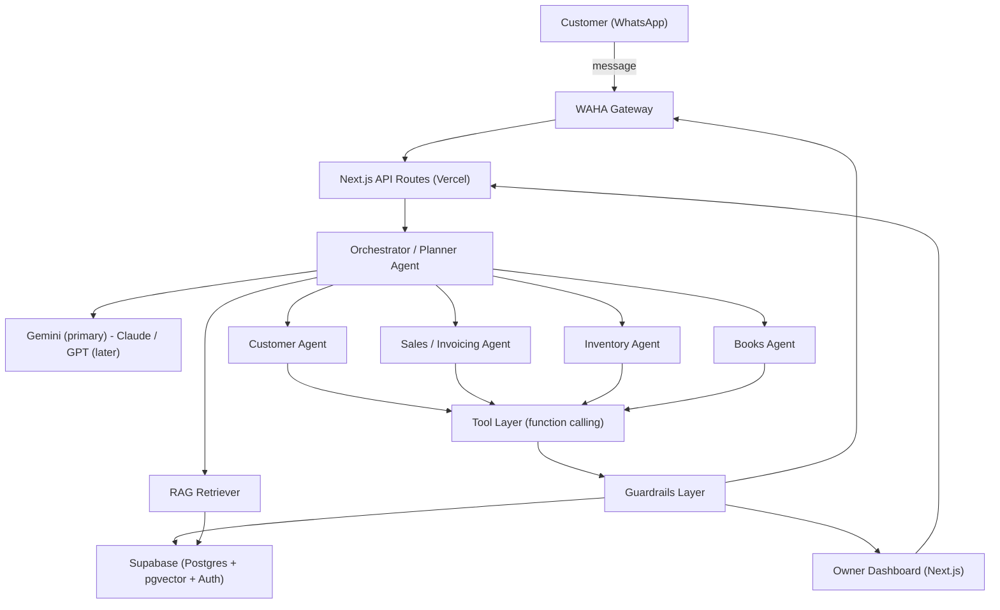
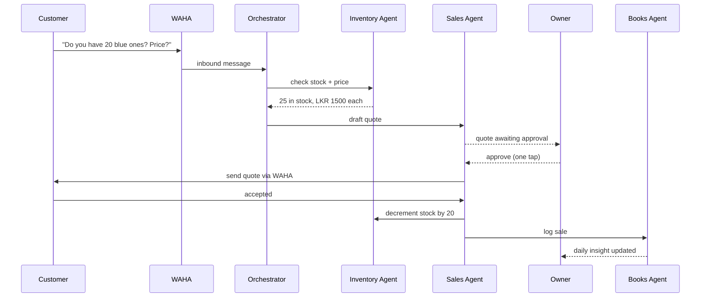

# Deskops AI — System Architecture

<aside>
🏗️

**How Deskops AI works end to end.** A multi-agent system where an Orchestrator routes work to specialist agents, each of which uses tools, retrieves grounded context (RAG), and passes through a guardrails layer before any real-world action.

</aside>

<aside>
🙋

**In plain English:** the business owner connects their WhatsApp. When a customer messages, Deskops AI's AI "staff" read it, check the real stock and prices, draft a quote or invoice, and wait for the owner to tap **Approve** before anything is sent. Every sale is booked automatically and the owner gets a daily summary. Think of it as a tireless back-office employee that never acts without permission. (A glossary of the technical terms is at the bottom.)

</aside>

<aside>
📚

**Engineering docs:** [Engineering Guide](./main.md) · [Database Design](./database-design.md) · [Project Structure & Routes](./folder-structure.md). This page is the architectural overview; those cover build conventions, the full database schema, and the codebase layout.

</aside>

## 1. High-level architecture

Everything runs on a single **Next.js** app on **Vercel**: Server Components render the owner dashboard, API routes host the agents through the **Vercel AI SDK**, the browser uses **TanStack Query** for live data, **Supabase** (Postgres + pgvector + Auth) is the single data backbone, and **WAHA** bridges WhatsApp. The model is provider-swappable — **Gemini** today, Claude/GPT later — behind one wrapper.

## 2. The agent team

<aside>
🧩

**Orchestrator (Planner)**

Reads the incoming intent, decides which specialist(s) to involve, sequences their work, and assembles the final response. The "brain" of the multi-agent system.

</aside>

<aside>
💬

**Customer Agent**

Understands customer messages, asks clarifying questions, and drafts replies in the business's tone.

</aside>

<aside>
🧾

**Sales / Invoicing Agent**

Builds quotes and invoices, calculates totals and tax, and sends them after owner approval.

</aside>

<aside>
📦

**Inventory Agent**

Checks stock levels, reserves items, decrements on sale, and flags low stock for reorder.

</aside>

<aside>
📊

**Books Agent** — logs every sale to the ledger, reconciles totals, and generates the daily business insight pushed to the owner.

</aside>

## 3. Flagship loop — sequence

The end-to-end "WhatsApp message → quote → sale → books" flow, showing where the human approval gate sits.

## 4. Data model (Supabase)

A simplified view of the core tables. The **full schema** — all 20+ tables, RLS policies, pgvector setup, and SQL functions — lives on the [Deskops AI — Database Design](Deskops%20AI%20%E2%80%94%20Database%20Design%2037cb2508c40e80e0b308ce7db628d3e5.md) page.

| Table | Key columns |
| --- | --- |
| `businesses` | id, name, owner_user_id, currency, settings |
| `products` | id, business_id, name, price, stock_qty, reorder_level |
| `customers` | id, business_id, name, whatsapp_number, notes |
| `conversations` | id, business_id, customer_id, channel, last_message_at |
| `messages` | id, conversation_id, direction, body, waha_message_id (dedupe) |
| `invoices` | id, business_id, customer_id, number, status, subtotal, tax, total |
| `invoice_items` | id, invoice_id, product_id, qty, unit_price, line_total |
| `ledger_entries` | id, business_id, type, amount, ref_invoice_id, created_at |
| `embeddings` | id, business_id, source, content, embedding vector(768) |
| `approvals` | id, business_id, action_type, payload (jsonb), status |

## 5. RAG pipeline

1. **Ingest** — products, past invoices, customer history, and local tax/compliance docs are chunked and embedded into the `embeddings` table.
2. **Retrieve** — on each request, the Orchestrator pulls the top-k relevant chunks via pgvector similarity search, scoped to the business.
3. **Ground** — retrieved context is injected into the agent prompt so answers cite real data, not guesses.

## 6. Guardrails layer

<aside>
🛡️

No agent touches the real world without passing these checks — this is the **ethics & safety** story for the 25% AI Agent Integration score.

</aside>

- **Human-in-the-loop approval** — any money-moving or outbound message is queued in `approvals` and requires one-tap owner confirmation.
- **PII handling** — customer numbers and personal data are redacted from logs and model traces.
- **Numeric verification** — financial figures are computed in code, never hallucinated by the model; the agent only formats them.
- **Scope isolation** — every query is filtered by `business_id` so no business can ever see another's data.

## 7. Tech-to-concept mapping

| IDEALIZE concept | Where it lives in Deskops AI |
| --- | --- |
| Multi-agent systems | Orchestrator + 4 specialist agents |
| Tool calling | create_invoice, send_whatsapp, update_stock, get_report |
| RAG | pgvector retrieval over business data + compliance docs |
| MCP | External services (Sheets, accounting) exposed as MCP servers |
| Guardrails | Approval gate, PII redaction, numeric verification |
| Deployment | Next.js on Vercel + Supabase + WAHA |
| Data fetching & caching | TanStack Query on the client; server prefetch + Next.js data cache |

## 8. Plain-English glossary

<aside>
📖

For non-technical readers — what the jargon on this page actually means.

</aside>

| Term | What it means |
| --- | --- |
| **Agent** | An AI worker with one job — e.g. the Sales Agent or Inventory Agent. |
| **Orchestrator** | The "manager" agent that reads a request and decides which workers handle it. |
| **Tool** | A specific action an agent can take, like "create invoice" or "check stock". |
| **RAG** | "Look it up first" — the AI reads your real business data before answering, so it doesn't guess. |
| **Guardrails** | Safety checks that stop the AI doing anything risky without approval. |
| **Human-in-the-loop** | A person taps Approve before any money or message goes out. |
| **Embeddings / pgvector** | The tech that lets the AI search your data by meaning, not just keywords. |
| **RLS (Row Level Security)** | A database rule so each business can only ever see its own data. |
| **WAHA** | The bridge that connects Deskops AI to WhatsApp. |